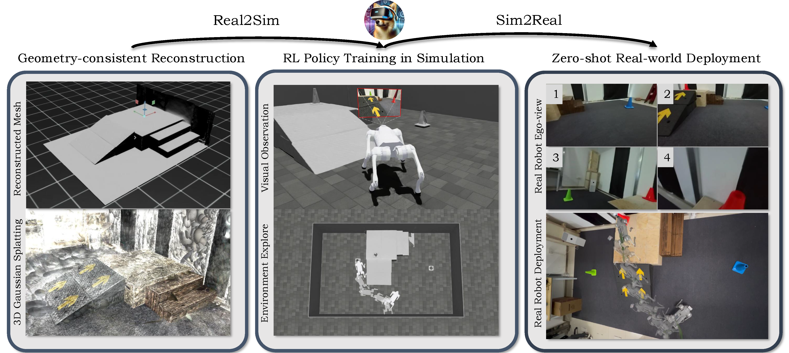

<div align="center">

# VR-Robo: A Real-to-Sim-to-Real Framework for Visual Robot Navigation and Locomotion

[](https://arxiv.org/abs/2502.01536) [](https://vr-robo.github.io/) 



</div>

## 🧷 News

- **[2025-02-01]** Paper released on arXiv.


## 📝 Citation

You can find our paper on [arXiv](https://arxiv.org/pdf/2502.01536).

If you find this code or find the paper useful for your research, please consider citing:

```
@article{zhu2025vr,
  title={VR-Robo: A Real-to-Sim-to-Real Framework for Visual Robot Navigation and Locomotion},
  author={Zhu, Shaoting and Mou, Linzhan and Li, Derun and Ye, Baijun and Huang, Runhan and Zhao, Hang},
  journal={arXiv preprint arXiv:2502.01536},
  year={2025}
}
```